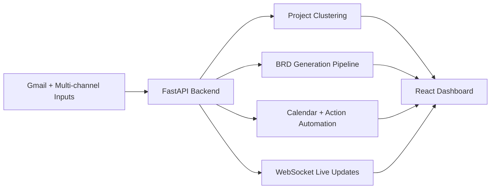

# Email-AIAgent

Multi-module repository for AI-assisted email operations, project clustering, and BRD generation.

The primary runnable stack in this repository is:

- **Backend:** FastAPI service in `nexus-backend/nexus`
- **Frontend:** React + Vite app in `nexus-frontend`

Other folders include BRD prototypes, static front-end experiments, and a Chrome extension for meeting capture/transcription.

## Architecture



## Repository Layout

- `nexus-backend/nexus/` - Main backend service (FastAPI, ingestion, clustering, BRD APIs)
- `nexus-frontend/` - Main React dashboard and operator UI
- `brd_agent/` - Standalone BRD extraction engine (Flask API + Streamlit UI)
- `brd-agent/` - Data/output workspace for BRD experiments
- `chrome-recording-transcription-extension/` - Chrome extension for Meet transcript + recording
- `frontend/` - Older static UI pages
- `BRD/`, `Informations/`, `model/` - Supporting project assets and notebooks

## Prerequisites

- Python 3.10+
- Node.js 18+
- npm
- A Google Cloud OAuth client (for Gmail/Calendar flows)
- Optional LLM provider credentials (Groq/local model), depending on enabled features

## Quick Start (Main App)

### 1) Start backend (FastAPI)

```powershell
cd nexus-backend/nexus
python -m venv .venv
.\.venv\Scripts\Activate.ps1
pip install -r requirements.txt
python main.py
```

Backend runs on `http://localhost:8000`.

### 2) Start frontend (React + Vite)

Open a second terminal:

```powershell
cd nexus-frontend
npm install
npm run dev
```

Frontend runs on `http://localhost:5173`.

Vite is configured to proxy `/api`, `/auth`, and `/ws` to the backend on port `8000`.

## Environment Configuration

Create/update environment files before running:

- `nexus-backend/nexus/.env`
- `nexus-frontend/.env`

Common backend variables include:

- Google auth files and redirect settings
- Ingestion and automation toggles (`MAX_EMAIL_FETCH`, auto-ingest flags)
- LLM/provider configuration
- Optional database/project service credentials

Frontend may require values such as:

- `VITE_GROQ_API_KEY` (if assistant UI features are enabled)

## Main Backend Capabilities

The backend exposes APIs for:

- Auth (`/auth/*`)
- Email retrieval and processing (`/api/emails*`)
- Action lifecycle (`/api/actions*`)
- Project CRUD and assignment (`/api/projects*`)
- BRD generation and download (`/api/brd*`)
- Calendar integration (`/api/calendar*`)
- Ingest orchestration (`/api/ingest*`, `/api/multi-channel*`)
- Live WebSocket updates (`/ws/live`)

## Optional Modules

### BRD standalone stack (`brd_agent`)

- Flask API entrypoint:

```powershell
python -m brd_agent.api
```

- Streamlit UI entrypoint:

```powershell
streamlit run brd_agent/frontend.py
```

### Chrome extension (`chrome-recording-transcription-extension`)

```powershell
cd chrome-recording-transcription-extension
npm install
npm run build
```

Then load `dist/` via Chrome Extensions (Developer Mode).

## Development Notes

- Keep backend and frontend running simultaneously for full functionality.
- WebSocket reconnect logic is handled in the frontend context provider.
- Several directories represent prototypes/iterations; prefer `nexus-backend/nexus` + `nexus-frontend` for active development.

## Security Note

If any real API keys or OAuth secrets are present in tracked files, rotate them immediately and move secrets to untracked local environment files.

## Troubleshooting

- If frontend cannot reach backend, verify backend is running on port `8000`.
- If auth flow fails, verify OAuth redirect URI matches backend callback endpoint.
- If BRD features fail, verify provider keys/model availability and related environment variables.

## License

No license file is currently defined at the repository root. Add one if you plan to distribute this project publicly.
